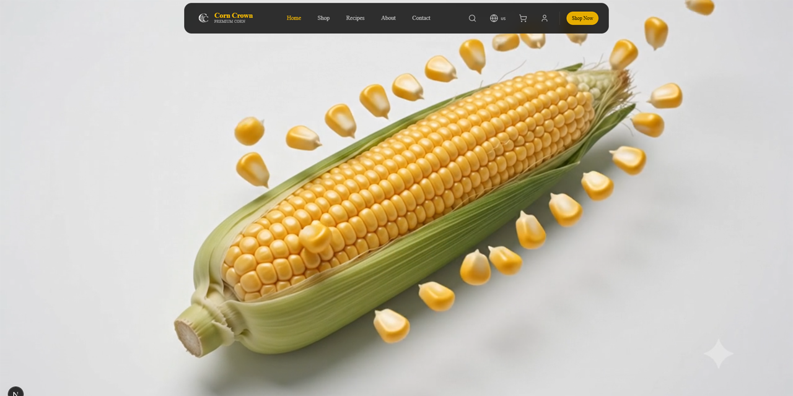

# 🌽 Corn Crown

<p align="center">
  <strong>A modern e-commerce experience built with Next.js.</strong><br/>
  Designed and developed with a strong focus on clean UI, smooth interactions, responsive layouts, and performance.
</p>

<p align="center">
  <a href="https://corn-crown.vercel.app"><strong>🌐 Live Demo</strong></a> •
  <a href="https://github.com/moeinrobati/corn-crown"><strong>📦 Repository</strong></a>
</p>

---

## Preview

> Replace the image below with your latest project screenshot.



---

# About

Corn Crown is a modern front-end e-commerce application developed using **Next.js** and **TypeScript**.

The project focuses on delivering a clean shopping experience through responsive layouts, smooth animations, multilingual support, and a modern user interface.

The application has been deployed on Vercel and is intended as a portfolio project demonstrating front-end architecture and UI implementation.

---

# Features

* Responsive Design
* Modern User Interface
* Product Showcase
* Product Details Page
* Shopping Cart UI
* User Login Interface
* Search Interface
* Dark Mode
* Loading Screen
* Scroll-based Hero Video
* Smooth Page Interactions
* Multilingual Support
* Optimized Component Structure

---

# Pages

* Home
* Products
* Product Details
* Cart
* About
* Contact
* Recipes

---

# Tech Stack

* Next.js
* React
* TypeScript
* Material UI
* Tailwind CSS
* ESLint

---

# Project Structure

```text
app/
components/
public/
styles/
types/
utils/
```

---

# Getting Started

Clone the repository:

```bash
git clone https://github.com/moeinrobati/corn-crown.git
```

Install dependencies:

```bash
npm install
```

Run the development server:

```bash
npm run dev
```

Open:

```
http://localhost:3000
```

---

# Live Demo

https://corn-crown.vercel.app

---

# GitHub Repository

https://github.com/moeinrobati/corn-crown

---

# Design

The interface was customized and assembled using reusable UI components and modern front-end practices, with attention to responsiveness, consistency, and usability.

---

# Performance

The project emphasizes:

* Fast page rendering
* Responsive layouts
* Clean component organization
* Modern development workflow
* Optimized user experience

---

# Future Improvements

* Backend integration
* Authentication
* Payment gateway
* Order management
* User dashboard
* Favorites / Wishlist
* Admin panel

---

# Author

**Moein Robati**

If you enjoyed this project, consider giving it a ⭐ on GitHub.
